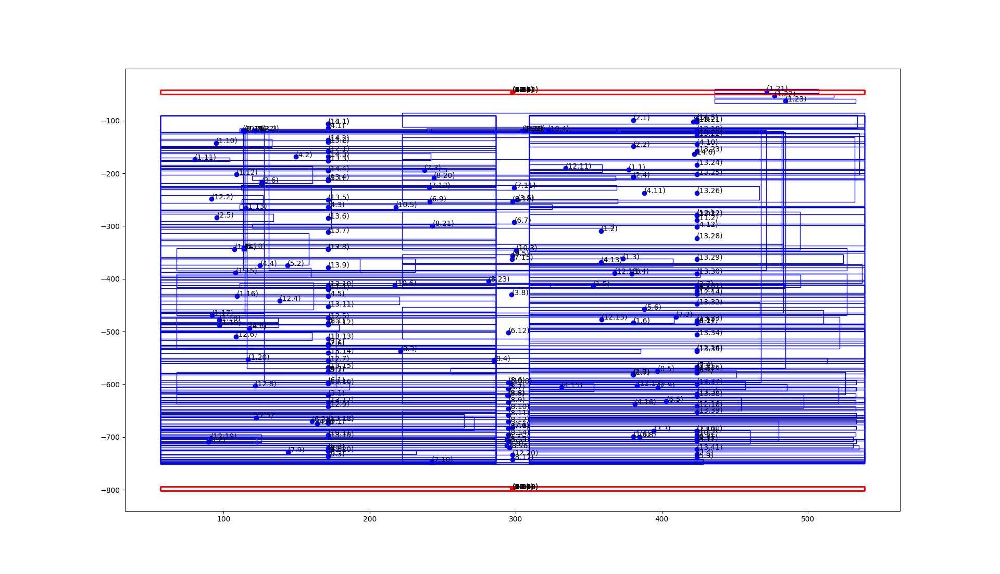

# GPT-Paper

Enhance paper search, reading, writing and review with the assistance of GPT.

## Installation of dependencies

**PyMuPDF:**

```sh
python -m pip install --upgrade pymupdf
```

**camolot-py:**

Camelot needs GhostScript and Tkinter:
  * https://camelot-py.readthedocs.io/en/master/user/install-deps.html

Download GhostScript:
* https://www.ghostscript.com/releases/gsdnld.html


```sh
python -m pip install --upgrade "camelot-py[base]"
```


**tabula-py:**

Tabular needs Java:
* https://tabula-py.readthedocs.io/en/latest/getting_started.html#get-tabula-py-working-windows-10

Download Java:
* https://www.java.com/en/download/manual.jsp


```sh
python -m pip install --upgrade tabula-py
```

## Data pre-processing

### Structure of PDF blocks

In fact, the structure of a PDF is more complex than most people imagine.

Hers is the dict structure of blocks in a page of a PDF document parsed via PyMuPDF.


### How to categorize headers and footers?

One practical method is to use clustering algorithms (such as **DBSCAN**) based on some metrics (such as the **coordinates** of the bound points for the block rectangle, and the **length** of the block text, in short: `(x0,y0,x1,y1,len(text))`).



See my answer here:

* Is there a way to delete headers/footers in PDF documents? · pymupdf/PyMuPDF · Discussion #2259
  * https://github.com/pymupdf/PyMuPDF/discussions/2259#discussioncomment-6669190