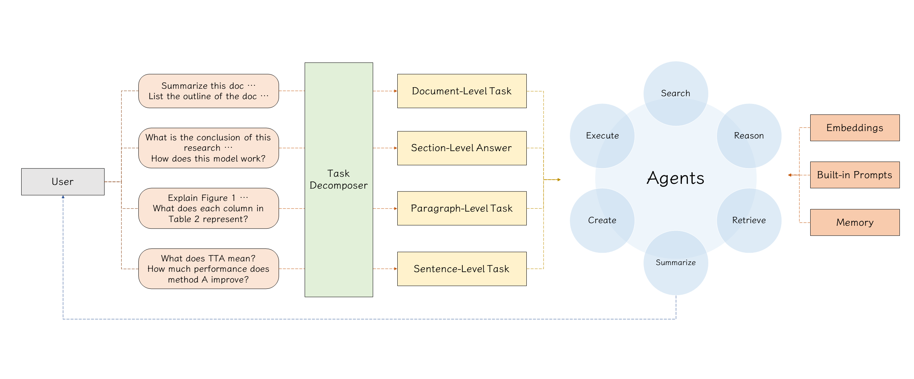

# GPT-Paper

Enhance paper search, reading, writing and review with the assistance of GPT.

## Installation of dependencies

**PyMuPDF**, **httpx**, **markdown2**, **PyDeepLX**, **deep-translator**, **Pygments**

```sh
pip install pymupdf httpx markdown2[all] PyDeepLX deep-translator Pygments
```

## Setup detectron2 and unilm

```sh
python -m utils.envs
```

**detectron2:**
* detectron2/blob/main/setup.py#L162-L215
  * https://github.com/facebookresearch/detectron2/blob/main/setup.py#L162-L215

```sh
pip install "Pillow>=7.1" matplotlib "pycocotools>=2.0.2" "termcolor>=1.1" "yacs>=0.1.8" tabulate cloudpickle "tqdm>4.29.0" tensorboard "fvcore>=0.1.5,<0.1.6" "iopath>=0.1.7,<0.1.10" "omegaconf>=2.1,<2.4" "hydra-core>=1.1" black packaging
pip install fairscale timm "scipy>1.5.1" shapely "pygments>=2.2" "psutil" "panopticapi @ https://github.com/cocodataset/panopticapi/archive/master.zip"
```

**tesseract-ocr**

Ubuntu:
* https://tesseract-ocr.github.io/tessdoc/Installation.html#ubuntu

```sh
sudo apt install tesseract-ocr
sudo apt install libtesseract-dev
```

Windows:

* https://github.com/UB-Mannheim/tesseract/wiki#tesseract-installer-for-windows
* https://tesseract-ocr.github.io/tessdoc/Installation.html#windows
* https://tesseract-ocr.github.io/tessdoc/Downloads.html

```sh
pip install pytesseract
```

* https://github.com/madmaze/pytesseract#installation


**sentence-transformers:**

```sh
pip install sentence-transformers
```

**JupyterLab:**

```sh
pip install jupyterlab notebook jupyterlab-widgets ipywidgets jupyter-black ipynbname
```

**Dash:**

```sh
pip install dash-mantine-components dash-dangerously-set-inner-html
```


## Data pre-processing




### Structure of PDF blocks

In fact, the structure of a PDF is more complex than most people imagine.

Hers is the dict structure of blocks in a page of a PDF document parsed via PyMuPDF.


## Layout Analysis
